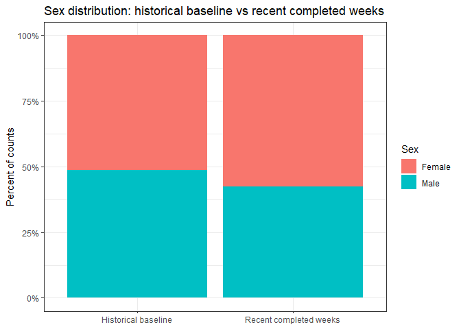
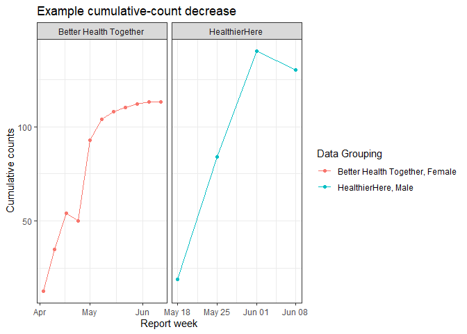
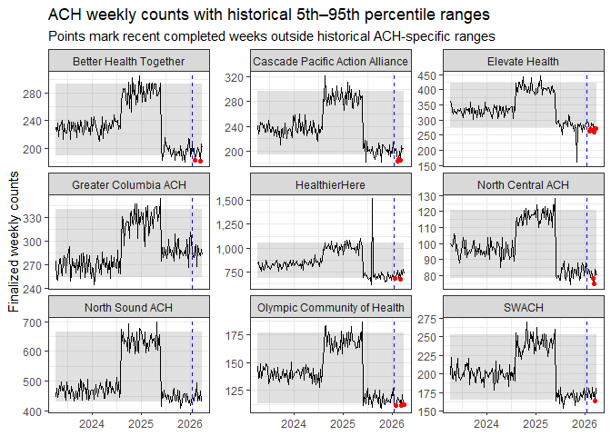
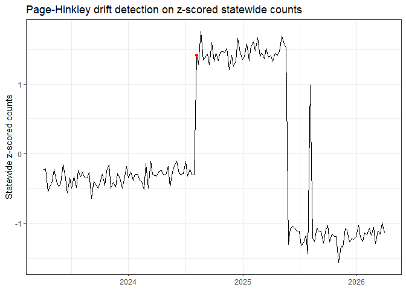
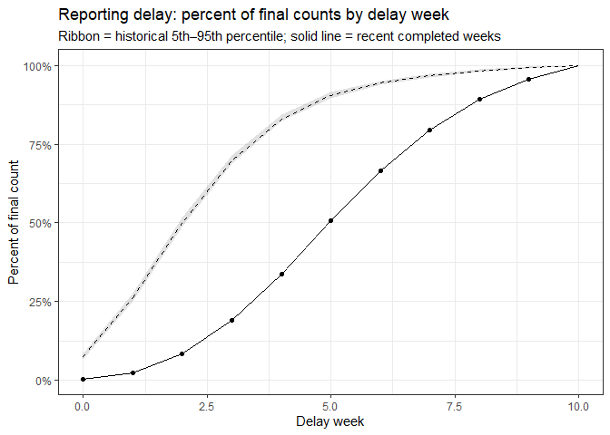

# Data Monitoring Tutorial
Allie Warren, allison.warren
2026-06-11

- [Overview](#overview)
- [Read in Data](#read-in-data)
- [Validate expected values and
  categories](#validate-expected-values-and-categories)
- [Check whether the distribution of a category
  changed](#check-whether-the-distribution-of-a-category-changed)
- [Cumulative counts should not
  decrease](#cumulative-counts-should-not-decrease)
- [Monitor counts against historical
  ranges](#monitor-counts-against-historical-ranges)
- [Detect sustained drift with
  Page-Hinkley](#detect-sustained-drift-with-page-hinkley)
- [Monitor reporting delay using percent of final
  counts](#monitor-reporting-delay-using-percent-of-final-counts)
- [View All Alerts](#view-all-alerts)

## Overview

This tutorial shows a basic monitoring workflow for weekly reported
public health count data.

The example synthetic data are cumulative delayed weekly counts:

- `report_week`: week when the data extract/report was produced

- `reference_week`: week when the events occurred

- `ach_region`: Washington Accountable Community of Health region

- `sex`: `Female` or `Male`

  `counts`: cumulative count for that `reference_week`, `ach_region`,
  and `sex` as of the `report_week`.

The data has been synthetically produced with some errors and assumes
counts are reported with some lag time (and a max lag of 10 weeks).

The tutorial includes:

1.  Rule-based validation with `validate`
2.  One category-distribution check using a chi-squared test
3.  Count monitoring to check that counts are increasing, fall within
    historical quantiles, and for sustained drift detection
4.  Reporting-delay monitoring using percent of final counts

``` r
# use pacman for loading/installing the other packages
if(!require("pacman")) install.packages("pacman") 
```

    Loading required package: pacman

``` r
# This load packages
pacman::p_load(readr, dplyr, tidyr, stringr, ggplot2, lubridate, validate, datadriftR)

set.seed(123)
```

``` r
current_report_week <- ymd("2026-06-08")
# set max data delay to 10 weeks
max_delay_weeks <- 10L
# get most recent date for complete data
latest_complete_reference_week <- current_report_week - ((max_delay_weeks-1)*7)
# get the previous 12 weeks of complete data - which we will evaluate compared to historic data
recent_completed_start <- latest_complete_reference_week - (12*7)
  
# expected categories for ACH regions and sex fields
expected_ach_regions <- c(
  "Olympic Community of Health",
  "North Sound ACH",
  "North Central ACH",
  "Better Health Together",
  "HealthierHere",
  "Elevate Health",
  "Cascade Pacific Action Alliance",
  "SWACH",
  "Greater Columbia ACH"
)

expected_sex_values <- c("Female", "Male")
```

## Read in Data

``` r
synthetic_counts <- read_csv("../data/synthetic_reporting_data.csv")
```

    Rows: 32076 Columns: 5
    ── Column specification ────────────────────────────────────────────────────────
    Delimiter: ","
    chr  (2): ach_region, sex
    dbl  (1): counts
    date (2): report_week, reference_week

    ℹ Use `spec()` to retrieve the full column specification for this data.
    ℹ Specify the column types or set `show_col_types = FALSE` to quiet this message.

``` r
current_extract <- synthetic_counts |>
  filter(report_week == current_report_week)

head(current_extract)
```

    # A tibble: 6 × 5
      report_week reference_week ach_region                      sex    counts
      <date>      <date>         <chr>                           <chr>   <dbl>
    1 2026-06-08  2026-03-30     Better Health Together          Female    122
    2 2026-06-08  2026-03-30     Better Health Together          Male       79
    3 2026-06-08  2026-03-30     Cascade Pacific Action Alliance Female    115
    4 2026-06-08  2026-03-30     Cascade Pacific Action Alliance Male       87
    5 2026-06-08  2026-03-30     Elevate Health                  Female    153
    6 2026-06-08  2026-03-30     Elevate Health                  Male      124

``` r
# create format for data alert data
alert_table <- tibble(
    check_type = character(),
    alert_level = character(),
    message = character())
```

## Validate expected values and categories

The `validate` package is useful when you want explicit rules that can
be run repeatedly on each incoming data extract.

Here we check:

- `reference_week` is not after `report_week`;
- `counts` is present and nonnegative;
- `sex` is either `Female` or `Male` and not NA
- `ach_region` is one of the expected ACH regions.

``` r
# create rule set
validation_rules <- validator(
  reference_week <= report_week,
  !is.na(counts),
  counts >= 0,
  !is.na(sex),
  sex %in% expected_sex_values,
  !is.na(ach_region),
  ach_region %in% expected_ach_regions)

# apply ruleset to the dataset
validation_results <- confront(synthetic_counts, validation_rules)

# view if there are errors in the data
validation_summary <- summary(validation_results)
validation_summary |> select(items, fails, expression)
```

      items fails                            expression
    1 32076     0         reference_week <= report_week
    2 32076     0                        !is.na(counts)
    3 32076     0                  counts - 0 >= -1e-08
    4 32076     1                           !is.na(sex)
    5 32076     1         sex %vin% expected_sex_values
    6 32076     0                    !is.na(ach_region)
    7 32076     0 ach_region %vin% expected_ach_regions

``` r
# add error to alert table
validation_alerts <- validation_summary |>
  filter(fails > 0) |>
  # transmute creates a new data frame with only the newly created fields
  transmute(check_type = "validation checks",
            alert_level = "warning",
            message = str_glue("Data validation error: {expression}"))
alert_table <- rbind(alert_table, validation_alerts)
```

view the violating data rows

``` r
error_rows <- violating(synthetic_counts, validation_results)
error_rows
```

    # A tibble: 2 × 5
      report_week reference_week ach_region        sex     counts
      <date>      <date>         <chr>             <chr>    <dbl>
    1 2026-06-08  2026-05-11     North Central ACH <NA>        28
    2 2026-06-08  2026-05-25     SWACH             Unknown     44

``` r
# Get logical matrix of passes/fails (rows = observations, cols = rules)
status_matrix <- values(validation_results)

# Row indices that fail ANY rule
error_indices <- which(rowSums(!status_matrix, na.rm = TRUE) > 0)

# remove the error rows
synthetic_counts_clean <- synthetic_counts[-error_indices,]
```

## Check whether the distribution of a category changed

For this tutorial, we compare the sex distribution in the most recent
completed 12 reference weeks to the historical baseline.

Because counts are delayed, we use only reference weeks that are at
least `max_delay_weeks` old. That means delay week `max_delay_weeks` is
observed and can be treated as final.

The chi-squared test asks whether the distribution of counts across
`Female` and `Male` differs between the historical and recent completed
periods.

``` r
# filter to complete data
finalized_counts <- synthetic_counts_clean |>
  # removing the most recent 9 weeks of data, which are incomplete
  filter(reference_week <= latest_complete_reference_week,
         # filter to final counts - cases reported as of 10 weeks after ref data
         report_week == reference_week + weeks(max_delay_weeks))

# get proportion of counts for each sex for historic reporting period and more recent period
sex_distribution <- finalized_counts |>
  mutate(period = if_else(reference_week >= recent_completed_start,
                          "Recent completed weeks",
                          "Historical baseline")) |>
  summarise(counts = sum(counts), .by = c(period, sex)) |>
  mutate(prop = counts / sum(counts), .by = period)

sex_distribution
```

    # A tibble: 4 × 4
      period                 sex    counts  prop
      <chr>                  <chr>   <dbl> <dbl>
    1 Historical baseline    Female 217422 0.512
    2 Historical baseline    Male   207146 0.488
    3 Recent completed weeks Female  17279 0.577
    4 Recent completed weeks Male    12651 0.423

``` r
sex_matrix <- sex_distribution |>
  select(period, sex, counts) |>
  pivot_wider(names_from = sex, values_from = counts, values_fill = 0) |>
  tibble::column_to_rownames("period") |>
  as.matrix()

# chi square test
sex_chisq <- chisq.test(sex_matrix)

sex_chisq_summary <- tibble(statistic = unname(sex_chisq$statistic),
                            df = unname(sex_chisq$parameter),
                            p_value = sex_chisq$p.value)

sex_chisq_summary
```

    # A tibble: 1 × 3
      statistic    df   p_value
          <dbl> <int>     <dbl>
    1      476.     1 1.71e-105

``` r
# add to alerts table if the distribution likely changed
sex_distribution_alerts <- sex_chisq_summary |>
  filter(p_value < 0.01) |>
  transmute(check_type = "category_distribution",
            alert_level = "warning",
            message = str_glue("Chi-squared test suggests the recent sex distribution changed: p = {signif(p_value, 3)}"))

alert_table <- rbind(alert_table, sex_distribution_alerts)
```

visualize the change in distribution

``` r
sex_distribution |>
  ggplot(aes(x = period, y = prop, fill = sex)) +
  geom_col(position = "fill") +
  scale_y_continuous(labels = scales::label_percent()) +
  theme_bw() +
  labs(title = "Sex distribution: historical baseline vs recent completed weeks",
       x = NULL,
       y = "Percent of counts",
       fill = "Sex")
```



## Cumulative counts should not decrease

For a fixed `reference_week`, `ach_region`, and `sex`, cumulative counts
should only increase or stay the same as `report_week` advances (this
assumption is likely not true in real data, but it is good to identify
in your data as it may cause issues).

``` r
# check whether the current weekly counts (for a given region and group) have decreased compared to the previous week
decreasing_counts_issues <- synthetic_counts |>
  filter(sex %in% expected_sex_values,
         ach_region %in% expected_ach_regions) |>
  arrange(ach_region, sex, reference_week, report_week) |>
  mutate(previous_counts = lag(counts),
         decrease = counts < previous_counts,
         .by = c(ach_region, sex, reference_week)) |>
  filter(decrease)

decreasing_counts_issues
```

    # A tibble: 2 × 7
      report_week reference_week ach_region    sex   counts previous_counts decrease
      <date>      <date>         <chr>         <chr>  <dbl>           <dbl> <lgl>   
    1 2023-04-24  2023-04-03     Better Healt… Fema…     50              54 TRUE    
    2 2026-06-08  2026-05-18     HealthierHere Male     130             140 TRUE    

``` r
# add to alert table
decreasing_counts_alerts <- decreasing_counts_issues |>
  transmute(check_type = "reporting_delay",
            alert_level = "critical",
            message = str_glue("Cumulative counts decreased from {previous_counts} to {counts} as reporting advanced to {report_week}"))

alert_table <- rbind(alert_table, decreasing_counts_alerts)
```

visualize examples of the decreasing counts

``` r
if (nrow(decreasing_counts_issues) > 0) {

  decreasing_counts_data <- inner_join(synthetic_counts_clean, decreasing_counts_issues |> select(-report_week), by = c('reference_week', 'ach_region', 'sex'))

  decreasing_counts_data |>
    ggplot(aes(x = report_week, y = counts.x, color = paste0(ach_region, ", ", sex))) +
    geom_line() +
    geom_point() +
    theme_bw() +
    labs(title = "Example cumulative-count decrease",
         x = "Report week",
         y = "Cumulative counts", color = 'Data Grouping') +
    facet_wrap(vars(ach_region), scales = "free_x")

}
```



## Monitor counts against historical ranges

Next we aggregate finalized counts by ACH region and reference week. We
compare recent completed values to each ACH region’s historical 5th and
95th percentile range.

This is a simple range-based monitoring rule:

- below historical 5th percentile: unusually low;
- above historical 95th percentile: unusually high.

``` r
# get weekly counts per ach region - using counts reported by 10 weeks after the reference data
ach_week_counts <- finalized_counts |>
  summarise(counts = sum(counts), .by = c(reference_week, ach_region))

count_bounds <- ach_week_counts |>
  filter(reference_week < recent_completed_start) |>
  summarise(median_count = median(counts),
            lower_bound = quantile(counts, 0.05),
            upper_bound = quantile(counts, 0.95), .by = ach_region)

# compare historic count ranges to the current counts
recent_count_monitoring <- ach_week_counts |>
  filter(reference_week >= recent_completed_start) |>
  left_join(count_bounds, by = join_by(ach_region)) |>
  mutate(count_alert = counts < lower_bound | counts > upper_bound,
         direction = case_when(counts < lower_bound ~ "low",
                               counts > upper_bound ~ "high",
                               TRUE ~ "normal"))

# view coutns outside of the normal range
recent_count_monitoring |>
  filter(count_alert)
```

    # A tibble: 19 × 8
       reference_week ach_region         counts median_count lower_bound upper_bound
       <date>         <chr>               <dbl>        <dbl>       <dbl>       <dbl>
     1 2026-01-19     HealthierHere         677          843       678.        1057.
     2 2026-01-26     Olympic Community…    111          141       113          177 
     3 2026-02-02     Better Health Tog…    183          232       189.         293 
     4 2026-02-02     Elevate Health        264          335       276.         421 
     5 2026-02-09     Cascade Pacific A…    183          235       194.         297.
     6 2026-02-09     Elevate Health        268          335       276.         421 
     7 2026-02-16     Cascade Pacific A…    186          235       194.         297.
     8 2026-03-02     Cascade Pacific A…    185          235       194.         297.
     9 2026-03-02     HealthierHere         668          843       678.        1057.
    10 2026-03-02     North Central ACH      78           96        78.2        121 
    11 2026-03-09     Elevate Health        259          335       276.         421 
    12 2026-03-09     North Central ACH      75           96        78.2        121 
    13 2026-03-09     Olympic Community…    111          141       113          177 
    14 2026-03-16     Better Health Tog…    181          232       189.         293 
    15 2026-03-16     Elevate Health        273          335       276.         421 
    16 2026-03-16     SWACH                 164          201       165          253 
    17 2026-03-23     Elevate Health        271          335       276.         421 
    18 2026-03-23     Olympic Community…    112          141       113          177 
    19 2026-03-30     Olympic Community…    112          141       113          177 
    # ℹ 2 more variables: count_alert <lgl>, direction <chr>

``` r
# add to alert table
count_alerts <- recent_count_monitoring |>
  filter(count_alert) |>
  transmute(check_type = "count_range",
            alert_level = "warning",
            message = str_glue("{ach_region} count was {direction}: {counts} vs expected range ",
      "{round(lower_bound)}-{round(upper_bound)} for week {reference_week}"))

alert_table <- rbind(alert_table, count_alerts)
```

visualize counts compared to historic ranges

``` r
ach_week_counts |> left_join(count_bounds, by = join_by(ach_region)) |>
  ggplot(aes(x = reference_week, y = counts)) +
  geom_ribbon(aes(ymin = lower_bound, ymax = upper_bound), alpha = 0.15) +
  geom_line() +
  # add vertical line for the mark the recent counts that we are evaluating
  geom_vline(aes(xintercept = recent_completed_start), color = 'blue', linetype = 'dashed') +
  # add points for counts that fall outside of the bounds
  geom_point(data = recent_count_monitoring |> filter(count_alert),
             aes(x = reference_week, y = counts), color = 'red') +
  theme_bw() +
  # create separate plots for each region
  facet_wrap(vars(ach_region), scales = "free_y") +
  scale_y_continuous(labels = scales::label_comma()) +
  labs(title = "ACH weekly counts with historical 5th–95th percentile ranges",
       subtitle = "Points mark recent completed weeks outside historical ACH-specific ranges",
       x = NULL,
       y = "Finalized weekly counts")
```



## Detect sustained drift with Page-Hinkley

Quantile checks are good at finding individual unusual values.
Page-Hinkley is more useful for detecting sustained shifts in a numeric
stream. It continuously monitors the cumulative deviation of incoming
data from its running mean. If the deviation exceeds a predefined
threshold it signals a change in the data distribution.

Here we apply `datadriftR::detect_drift()` to statewide finalized weekly
counts. To make tuning less dependent on the absolute count scale we
z-score the counts.

``` r
statewide_counts <- ach_week_counts |>
  summarise(counts = sum(counts), .by = reference_week)

hist_stats <- statewide_counts |>
  filter(reference_week < recent_completed_start) |>
  summarise(mu = mean(counts), sigma = sd(counts))

statewide_counts <- statewide_counts |>
  mutate(count_z = (counts - hist_stats$mu) / hist_stats$sigma)

page_hinkley_results <- datadriftR::detect_drift(stream = statewide_counts$count_z,
                                                 method = "page_hinkley",
                                                 delta = 0.01,    # allowable slack in SD units
                                                 threshold = 2.0,     # ~2 SD cumulative shift triggers alarm
                                                 min_instances = 15) |>
  as_tibble()

page_hinkley_points <- page_hinkley_results |>
  filter(type == "drift") |>
  mutate(reference_week = statewide_counts$reference_week[index],
         count_index = statewide_counts$count_index[index])
```

    Warning: There was 1 warning in `mutate()`.
    ℹ In argument: `count_index = statewide_counts$count_index[index]`.
    Caused by warning:
    ! Unknown or uninitialised column: `count_index`.

``` r
page_hinkley_points
```

    # A tibble: 1 × 4
      index value type  reference_week
      <int> <dbl> <chr> <date>        
    1    71  1.41 drift 2024-08-05    

``` r
# add to alert table
page_hinkley_alerts <- page_hinkley_points |>
  transmute(check_type = "page_hinkley",
            alert_level = "info",
            message = str_glue("Page-Hinkley detected sustained drift around {reference_week} in statewide counts"))

alert_table <- rbind(alert_table, page_hinkley_alerts)
```

- Page-Hinkley flags points where the stream appears to have shifted
  persistently.
- It is sensitive to tuning choices such as `delta`, `threshold`, and
  `min_instances`.
- It is usually better to run it on a monitored metric, rather than raw
  counts with very different scales.

Visualize:

``` r
statewide_counts |>
  ggplot(aes(x = reference_week, y = count_z)) +
  geom_line() +
  geom_point(data = page_hinkley_points,
             aes(x = reference_week, y = value), color = 'red') +
  theme_bw() +
  labs(title = "Page-Hinkley drift detection on z-scored statewide counts",
       x = NULL,
       y = "Statewide z-scored counts") 
```



## Monitor reporting delay using percent of final counts

For cumulative delayed data, counts for a reference week should increase
as more report weeks arrive.

For completed reference weeks, define:

\[ d = \]

This uses only reference weeks that are at least 10 weeks old, so the
delay-10 value is observed.

``` r
delay_percent <- synthetic_counts_clean |>
  filter(reference_week <= latest_complete_reference_week,
         sex %in% expected_sex_values,
         ach_region %in% expected_ach_regions) |>
  mutate(delay_week = as.integer(report_week - reference_week) / 7L) |>
  filter(delay_week >= 0, delay_week <= max_delay_weeks) |>
  summarise(counts = sum(counts), .by = c(reference_week, delay_week)) |>
  left_join(finalized_counts |>
              summarise(final_counts = sum(counts), .by = reference_week),
            by = join_by(reference_week)) |>
  filter(final_counts > 0) |>
  mutate(pct_final = counts / final_counts,
         period = if_else(reference_week >= recent_completed_start,
                          "Recent completed weeks",
                          "Historical baseline"))

delay_percent |>
  arrange(desc(reference_week), delay_week) |>
  head(15)
```

    # A tibble: 15 × 6
       reference_week delay_week counts final_counts pct_final period               
       <date>              <dbl>  <dbl>        <dbl>     <dbl> <chr>                
     1 2026-03-30              0      7         2496   0.00280 Recent completed wee…
     2 2026-03-30              1     59         2496   0.0236  Recent completed wee…
     3 2026-03-30              2    215         2496   0.0861  Recent completed wee…
     4 2026-03-30              3    492         2496   0.197   Recent completed wee…
     5 2026-03-30              4    852         2496   0.341   Recent completed wee…
     6 2026-03-30              5   1266         2496   0.507   Recent completed wee…
     7 2026-03-30              6   1690         2496   0.677   Recent completed wee…
     8 2026-03-30              7   2015         2496   0.807   Recent completed wee…
     9 2026-03-30              8   2241         2496   0.898   Recent completed wee…
    10 2026-03-30              9   2380         2496   0.954   Recent completed wee…
    11 2026-03-30             10   2496         2496   1       Recent completed wee…
    12 2026-03-23              0     14         2553   0.00548 Recent completed wee…
    13 2026-03-23              1     70         2553   0.0274  Recent completed wee…
    14 2026-03-23              2    209         2553   0.0819  Recent completed wee…
    15 2026-03-23              3    479         2553   0.188   Recent completed wee…

compare current data delays compared to historic delays

``` r
historical_delay_band <- delay_percent |>
  filter(period == "Historical baseline") |>
  summarise(historical_mean = mean(pct_final),
            historical_p05 = quantile(pct_final, 0.05),
            historical_p95 = quantile(pct_final, 0.95),
            .by = delay_week)

recent_delay_line <- delay_percent |>
  filter(period == "Recent completed weeks") |>
  summarise(recent_mean = mean(pct_final), .by = delay_week)

delay_monitoring <- recent_delay_line |>
  left_join(historical_delay_band, by = join_by(delay_week)) |>
  mutate(slow_reporting_alert = recent_mean < historical_p05)

delay_monitoring
```

    # A tibble: 11 × 6
       delay_week recent_mean historical_mean historical_p05 historical_p95
            <dbl>       <dbl>           <dbl>          <dbl>          <dbl>
     1          0     0.00384          0.0740         0.0666         0.0823
     2          1     0.0241           0.262          0.250          0.276 
     3          2     0.0847           0.497          0.486          0.516 
     4          3     0.190            0.698          0.688          0.713 
     5          4     0.338            0.829          0.823          0.843 
     6          5     0.506            0.904          0.896          0.914 
     7          6     0.666            0.944          0.939          0.952 
     8          7     0.796            0.967          0.962          0.974 
     9          8     0.892            0.982          0.978          0.987 
    10          9     0.957            0.993          0.991          0.995 
    11         10     1                1              1              1     
    # ℹ 1 more variable: slow_reporting_alert <lgl>

``` r
# add to alert table
delay_alerts <- delay_monitoring |>
  filter(slow_reporting_alert) |>
  transmute(check_type = "reporting_delay",
            alert_level = "warning",
            message = str_glue("Recent percent final is low at delay week {delay_week}: ",
                               "{scales::percent(recent_mean, accuracy = 0.1)} vs historical 5th percentile ",
                               "{scales::percent(historical_p05, accuracy = 0.1)}"))

alert_table <- rbind(alert_table, delay_alerts)
```

visualize:

``` r
historical_delay_band |>
  ggplot(aes(x = delay_week)) +
  geom_ribbon(aes(ymin = historical_p05, ymax = historical_p95), alpha = 0.15) +
  geom_line(aes(y = historical_mean), linetype = "dashed") +
  geom_line(data = recent_delay_line,
            aes(y = recent_mean)) +
  geom_point(data = delay_monitoring |> filter(slow_reporting_alert),
             aes(y = recent_mean)) +
  scale_y_continuous(labels = scales::label_percent()) +
  theme_bw() +
  labs(title = "Reporting delay: percent of final counts by delay week",
       subtitle = "Ribbon = historical 5th–95th percentile; solid line = recent completed weeks",
       x = "Delay week",
       y = "Percent of final count" )
```



## View All Alerts

``` r
alert_table
```

                  check_type alert_level
    1      validation checks     warning
    2      validation checks     warning
    3  category_distribution     warning
    4        reporting_delay    critical
    5        reporting_delay    critical
    6            count_range     warning
    7            count_range     warning
    8            count_range     warning
    9            count_range     warning
    10           count_range     warning
    11           count_range     warning
    12           count_range     warning
    13           count_range     warning
    14           count_range     warning
    15           count_range     warning
    16           count_range     warning
    17           count_range     warning
    18           count_range     warning
    19           count_range     warning
    20           count_range     warning
    21           count_range     warning
    22           count_range     warning
    23           count_range     warning
    24           count_range     warning
    25          page_hinkley        info
    26       reporting_delay     warning
    27       reporting_delay     warning
    28       reporting_delay     warning
    29       reporting_delay     warning
    30       reporting_delay     warning
    31       reporting_delay     warning
    32       reporting_delay     warning
    33       reporting_delay     warning
    34       reporting_delay     warning
    35       reporting_delay     warning
                                                                                                message
    1                                                                Data validation error: !is.na(sex)
    2                                              Data validation error: sex %vin% expected_sex_values
    3                      Chi-squared test suggests the recent sex distribution changed: p = 1.71e-105
    4                     Cumulative counts decreased from 54 to 50 as reporting advanced to 2023-04-24
    5                   Cumulative counts decreased from 140 to 130 as reporting advanced to 2026-06-08
    6                   HealthierHere count was low: 677 vs expected range 678-1057 for week 2026-01-19
    7      Olympic Community of Health count was low: 111 vs expected range 113-177 for week 2026-01-26
    8           Better Health Together count was low: 183 vs expected range 189-293 for week 2026-02-02
    9                   Elevate Health count was low: 264 vs expected range 276-421 for week 2026-02-02
    10 Cascade Pacific Action Alliance count was low: 183 vs expected range 194-297 for week 2026-02-09
    11                  Elevate Health count was low: 268 vs expected range 276-421 for week 2026-02-09
    12 Cascade Pacific Action Alliance count was low: 186 vs expected range 194-297 for week 2026-02-16
    13 Cascade Pacific Action Alliance count was low: 185 vs expected range 194-297 for week 2026-03-02
    14                  HealthierHere count was low: 668 vs expected range 678-1057 for week 2026-03-02
    15                 North Central ACH count was low: 78 vs expected range 78-121 for week 2026-03-02
    16                  Elevate Health count was low: 259 vs expected range 276-421 for week 2026-03-09
    17                 North Central ACH count was low: 75 vs expected range 78-121 for week 2026-03-09
    18     Olympic Community of Health count was low: 111 vs expected range 113-177 for week 2026-03-09
    19          Better Health Together count was low: 181 vs expected range 189-293 for week 2026-03-16
    20                  Elevate Health count was low: 273 vs expected range 276-421 for week 2026-03-16
    21                           SWACH count was low: 164 vs expected range 165-253 for week 2026-03-16
    22                  Elevate Health count was low: 271 vs expected range 276-421 for week 2026-03-23
    23     Olympic Community of Health count was low: 112 vs expected range 113-177 for week 2026-03-23
    24     Olympic Community of Health count was low: 112 vs expected range 113-177 for week 2026-03-30
    25                      Page-Hinkley detected sustained drift around 2024-08-05 in statewide counts
    26              Recent percent final is low at delay week 0: 0.4% vs historical 5th percentile 6.7%
    27             Recent percent final is low at delay week 1: 2.4% vs historical 5th percentile 25.0%
    28             Recent percent final is low at delay week 2: 8.5% vs historical 5th percentile 48.6%
    29            Recent percent final is low at delay week 3: 19.0% vs historical 5th percentile 68.8%
    30            Recent percent final is low at delay week 4: 33.8% vs historical 5th percentile 82.3%
    31            Recent percent final is low at delay week 5: 50.6% vs historical 5th percentile 89.6%
    32            Recent percent final is low at delay week 6: 66.6% vs historical 5th percentile 93.9%
    33            Recent percent final is low at delay week 7: 79.6% vs historical 5th percentile 96.2%
    34            Recent percent final is low at delay week 8: 89.2% vs historical 5th percentile 97.8%
    35            Recent percent final is low at delay week 9: 95.7% vs historical 5th percentile 99.1%
