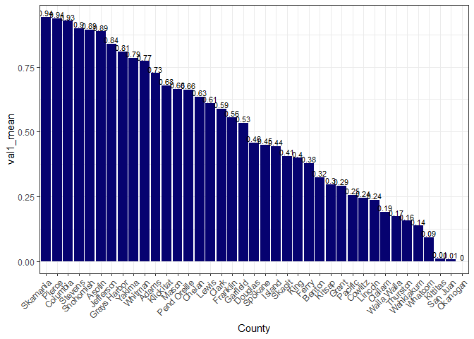
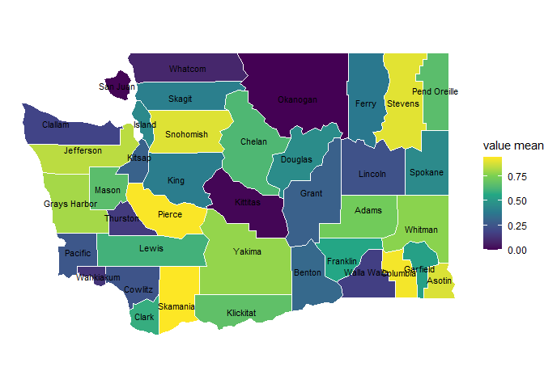

# Exploratory_Data_Analysis
Allie Warren, allison.warren
2025-11-13

- [Exploratory Data Analysis](#exploratory-data-analysis)
- [Setup](#setup)
- [Reading in the Data](#reading-in-the-data)
- [Data Basics](#data-basics)
- [Identifying Errors in the Data](#identifying-errors-in-the-data)
  - [Missing Data](#missing-data)
- [Cleaning Data](#cleaning-data)
  - [Cleaning Strings](#cleaning-strings)
  - [Replacing Missing Values and Converting to
    Numeric](#replacing-missing-values-and-converting-to-numeric)
  - [Cleaning Address Data](#cleaning-address-data)
  - [Extracting Phone Number](#extracting-phone-number)
- [Joining data](#joining-data)
- [Viewing the Cleaned Data](#viewing-the-cleaned-data)
- [Calculating summary stats](#calculating-summary-stats)
- [Visualizing](#visualizing)
  - [Bar Plots](#bar-plots)
  - [Map Plot](#map-plot)

## Exploratory Data Analysis

This notebook shows an example of starting exploring a data set. The
notebook uses the [tidyverse](https://tidyverse.org/packages) functions
and conventions, which is a collection of packages for data science and
visualization that have a common design. This also, for the most part,
uses modern tidyverse conventions, using R version 4.3+ features. For
example, it uses the pipe `|>` instead of `%>%` to chain together
functions, this guide is a good resource for [modern R
development](https://gist.github.com/sj-io/3828d64d0969f2a0f05297e59e6c15ad).
This following notebook includes:

- observing key characteristics of data

- cleaning data, including identifying missing data

- combining data

- grouping data and calculating summary statistics

- visualizing data

For the purpose of this notebook I have created a synthetic data set
that can be used to illustrate some of the key challenges that may exist
in a data set.

## Setup

``` r
# Loading packages

# the pacman package is useful for managing package install/loading, When using pacman to load a package it will automatically install the package if it is not already installed
if(!require("pacman")) install.packages("pacman") #but first we have to install pacman
```

    Loading required package: pacman

``` r
# This load packages for reading in data, transforming data, reshaping data, summarizing data, identifying missing data, working with dates and string, visualizing data (greating plots, map plots, color schemes), additional text cleaning, and viewing tables
pacman::p_load(readr, dplyr, tidyr, purrr, skimr, naniar, lubridate, stringr, ggplot2, usmap, sf, viridis, textclean, DT)
```

## Reading in the Data

``` r
# Reading in the data
base_file_path <- "../data"

wa_health_data <- read_csv(file.path(base_file_path, "synthetic_wa_records.csv"))
```

    Rows: 500 Columns: 12
    ── Column specification ────────────────────────────────────────────────────────
    Delimiter: ","
    chr  (10): first_name, last_name, phone_number, street, county, email, ID, d...
    dbl   (1): val1
    date  (1): dob

    ℹ Use `spec()` to retrieve the full column specification for this data.
    ℹ Specify the column types or set `show_col_types = FALSE` to quiet this message.

``` r
# loads in an R list containing different forms of street suffixes (e.g. Street, St, Square, Sq, Route, Rte), used for address cleaning
source(file.path(base_file_path, 'street_suffixes.R'))
# view the data
head(wa_health_data)
```

    # A tibble: 6 × 12
      first_name last_name  phone_number  street county email ID    dob        date 
      <chr>      <chr>      <chr>         <chr>  <chr>  <chr> <chr> <date>     <chr>
    1 Hoover     Swift      1-820-530-63… 642 7… Pierc… oo'c… 238-… 1960-06-05 2024…
    2 Jerimy     Hammes     120-107-6198  8085 … Clall… kraj… 163-… 1940-10-31 09/1…
    3 Emilee     Ferry      1-037-411-36… 3776 … Frank… dess… 781-… 1970-08-10 2025…
    4 Brittany   Cremin     133.055.7951  310  … Frank… ksch… 889-… 2010-09-03 2025…
    5 John       Kulas      (964)067-097… 784 W… Pierc… trom… 767-… 1937-08-01 04/1…
    6 Unknown    Jakubowski 1-285-564-32… 024 K… Clark… beni… 331-… 2017-04-10 2025…
    # ℹ 3 more variables: val1 <dbl>, val2 <chr>, val1_CI <chr>

## Data Basics

- data type for each column

- size of the data

- functions for summarizing data, including counting missing data,
  unique counts per column, summary stats

``` r
# can get basic characteristics of the data (data types, columns) and size of the data using base R functions
str(wa_health_data)
```

    spc_tbl_ [500 × 12] (S3: spec_tbl_df/tbl_df/tbl/data.frame)
     $ first_name  : chr [1:500] "Hoover" "Jerimy" "Emilee" "Brittany" ...
     $ last_name   : chr [1:500] "Swift" "Hammes" "Ferry" "Cremin" ...
     $ phone_number: chr [1:500] "1-820-530-6339" "120-107-6198" "1-037-411-3655x17041" "133.055.7951" ...
     $ street      : chr [1:500] "642 72th Avenue W" "8085 Noemie Way" "3776 5th St. NE" "310  Walsh Parks Drive" ...
     $ county      : chr [1:500] "Pierce County" "Clallam County" "Franklin County" "Franklin County" ...
     $ email       : chr [1:500] "oo'connell@gmail.com" "krajcik.glynn@yahoo.com" "dessa19@llc.org" "kschamberger@gleichner.com" ...
     $ ID          : chr [1:500] "238-81-8708" "163-43-7463" "781-67-7952" "889-26-9781" ...
     $ dob         : Date[1:500], format: "1960-06-05" "1940-10-31" ...
     $ date        : chr [1:500] "2024-02-24" "09/14/24" "2025/01/10" "2025-08-20" ...
     $ val1        : num [1:500] 1 0.34 0.964 0.924 0.825 0.703 0.349 0.06 0.454 0.237 ...
     $ val2        : chr [1:500] "1" "0.018" "0.914" "0.677" ...
     $ val1_CI     : chr [1:500] "0.99-1" "0.34-0.35" "0.88-0.99" "0.9-0.93" ...
     - attr(*, "spec")=
      .. cols(
      ..   first_name = col_character(),
      ..   last_name = col_character(),
      ..   phone_number = col_character(),
      ..   street = col_character(),
      ..   county = col_character(),
      ..   email = col_character(),
      ..   ID = col_character(),
      ..   dob = col_date(format = ""),
      ..   date = col_character(),
      ..   val1 = col_double(),
      ..   val2 = col_character(),
      ..   val1_CI = col_character()
      .. )
     - attr(*, "problems")=<externalptr> 

``` r
dim(wa_health_data)
```

    [1] 500  12

``` r
# for a more complete picture of the data there are useful packages that have summary functions, for example skim() from the skimr package
skim(wa_health_data)
```

|                                                  |                |
|:-------------------------------------------------|:---------------|
| Name                                             | wa_health_data |
| Number of rows                                   | 500            |
| Number of columns                                | 12             |
| \_\_\_\_\_\_\_\_\_\_\_\_\_\_\_\_\_\_\_\_\_\_\_   |                |
| Column type frequency:                           |                |
| character                                        | 10             |
| Date                                             | 1              |
| numeric                                          | 1              |
| \_\_\_\_\_\_\_\_\_\_\_\_\_\_\_\_\_\_\_\_\_\_\_\_ |                |
| Group variables                                  | None           |

Data summary

**Variable type: character**

| skim_variable | n_missing | complete_rate | min | max | empty | n_unique | whitespace |
|:--------------|----------:|--------------:|----:|----:|------:|---------:|-----------:|
| first_name    |         0 |          1.00 |   2 |  11 |     0 |      479 |          0 |
| last_name     |         0 |          1.00 |   3 |  13 |     0 |      317 |          0 |
| phone_number  |         0 |          1.00 |  11 |  20 |     0 |      500 |          0 |
| street        |         2 |          1.00 |   1 |  56 |     0 |      493 |          0 |
| county        |         0 |          1.00 |  10 |  19 |     0 |       44 |          0 |
| email         |         0 |          1.00 |  12 |  32 |     0 |      500 |          0 |
| ID            |         0 |          1.00 |  11 |  11 |     0 |      500 |          0 |
| date          |         0 |          1.00 |   8 |  10 |     0 |      449 |          0 |
| val2          |         7 |          0.99 |   1 |  14 |     0 |      323 |          0 |
| val1_CI       |         0 |          1.00 |   3 |   9 |     0 |      347 |          0 |

**Variable type: Date**

| skim_variable | n_missing | complete_rate | min | max | median | n_unique |
|:---|---:|---:|:---|:---|:---|---:|
| dob | 0 | 1 | 1930-01-18 | 2024-05-21 | 1977-09-14 | 493 |

**Variable type: numeric**

| skim_variable | n_missing | complete_rate | mean |   sd |  p0 |  p25 |  p50 |  p75 | p100 | hist  |
|:--------------|----------:|--------------:|-----:|-----:|----:|-----:|-----:|-----:|-----:|:------|
| val1          |         0 |             1 | 0.54 | 0.33 |   0 | 0.25 | 0.52 | 0.85 |    1 | ▅▆▅▃▇ |

## Identifying Errors in the Data

``` r
# there are 35 unique values in the County column - suggests a possible error - some additional/missing white space in some entries
n_distinct(wa_health_data$county)
```

    [1] 44

``` r
# try converting to a single date format - observe that many don't parse
length(which(is.na(mdy(wa_health_data$date))))
```

    Warning: 244 failed to parse.

    [1] 244

### Missing Data

``` r
# val2 is character - check for alternate missing data types
# skim shows counts of NA, but won't catch other forms of missing data
check_na <- c("^\\.$", "NA", "-99", "N/A", "Not Applicable", "na", "n/a", "Null", "null")
naniar::miss_scan_count(wa_health_data, check_na)
```

    # A tibble: 12 × 2
       Variable         n
       <chr>        <int>
     1 first_name      38
     2 last_name        7
     3 phone_number     6
     4 street          14
     5 county           0
     6 email           33
     7 ID               7
     8 dob              0
     9 date             0
    10 val1             0
    11 val2            11
    12 val1_CI          0

## Cleaning Data

- filter to relevant subset

- clean up string columns

- clean up date columns

``` r
# formatting dates
wa_health_data_cleaned <- wa_health_data |> 
  mutate(date_format = lubridate::ymd(lubridate::parse_date_time(date, orders = c("%m/%d/%Y", "%Y-%m-%d", "%Y/%m/%d", "%m-%d-%Y", "%m/%d/%y"))))
```

### Cleaning Strings

``` r
# cleaning up County names
wa_health_data_cleaned <- wa_health_data_cleaned |> 
  # remove County from the name and remove extra white space
  mutate(county_name = str_replace_all(county, "County", "")|> str_squish())

n_distinct(wa_health_data_cleaned$county_name)
```

    [1] 39

### Replacing Missing Values and Converting to Numeric

``` r
# replacing alternative missing values with NA
replace_na <- c(".", "NA", "-99", "N/A", "Not Applicable", "na", "n/a", "Null", "null")
wa_health_data_cleaned <- replace_with_na(wa_health_data_cleaned, replace = list(val2 = replace_na))

# and convert data to numeric 
wa_health_data_cleaned <- wa_health_data_cleaned |>
  mutate(val2 = as.numeric(val2))

# split the CI into 2 columns - split the column on '-' then convert new columns to numeric
wa_health_data_cleaned <- wa_health_data_cleaned |>
  separate_wider_delim(val1_CI, delim = "-", names = c('val1_lower_CI',
                                                           'val1_upper_CI')) |>
  mutate(across(ends_with("CI"), ~as.numeric(.)))
```

### Cleaning Address Data

``` r
# identifies if the input string only contains letters
letters_only <- function(x) {
  x |>  
  str_remove_all("[[:blank:]]") |> 
  str_remove_all("[[:punct:]]") |>
  str_detect("^[A-Za-z]+$")
}

# identifies if the input string contain U.S. street suffixes like avenue road, court, and different ways they are shortened.
containsstreetsuffix <- function(x) {
  x <- x |>
  str_remove_all("[[:blank:]]") |> 
  str_remove_all("[[:punct:]]")
  
  any(str_detect(str_to_lower(x), str_to_lower(street_suffix_list)))
}

# identify if the string contains fields that are not useful for geocoding and contain notes about living circumstance or unavailability of an address but which are not an address
containsstreetsuffixremove <- function(x) {
  x <- x |>
  str_remove_all("[[:blank:]]") |> 
  str_remove_all("[[:punct:]]") 
  
  any(str_detect(str_to_lower(x), c("student", "address", "homeless", "unkn", "null", "update"))) 
}

# identifies if the string is only numbers after removing blank spaces and punctuation - i.e. fields that are numbers only.
numbers_only <- function(x) {
  x |> 
  str_remove_all("[[:blank:]]") |> 
  str_remove_all("[[:punct:]]") |> 
  str_detect("^[0-9]+$")
}
 
# fields that are empty after removing blank spaces and punctuation - i.e. field that are punctuation only
punct_only<- function(x) x |> 
  str_remove_all("[[:blank:]]") |> 
  str_remove_all("[[:punct:]]") |> 
  str_detect("^$")


# Function to clean addresses, removing special characters and replacing common
# error inputs with NA
clean_address <- function(address) {
  # beginning cleaning the input string, removing special characters
  cleaned_address <- address |>
    as.character() |> 
    str_replace_all(pattern = "[^\x20-\x7E]", " ") |> 
    textclean::replace_non_ascii() |> 
    textclean::strip(char.keep = c("#", "-"), digit.remove = F, apostrophe.remove = T, lower.case = F)
  
  # if a PO box address replace with NA
  cleaned_address <- case_when(str_detect(str_to_lower(cleaned_address), "^(po|p\\.o\\.|p box|p\\. o) ")  ~ NA_character_,
                               TRUE ~cleaned_address)
  
  # convert to title case
  cleaned_address <- str_to_title(cleaned_address)
  
  # if less than 7 characters (often sign of missing data) replace with NA
  cleaned_address <- case_when(nchar(cleaned_address)<=7  ~ NA_character_,   TRUE ~cleaned_address)
  
  # replace with NA if the address doesn't look like an address because it is all numbers, all letters, missing a street suffix and matches a pattern of other strings
  cleaned_address <- case_when(
    letters_only(cleaned_address)==T ~ NA_character_,
    numbers_only(cleaned_address)==T ~ NA_character_,
    containsstreetsuffix(cleaned_address)==F &
    containsstreetsuffixremove(cleaned_address)==T  ~ NA_character_,
    TRUE ~ cleaned_address)
  
  cleaned_address
  
}

# for each address I will apply the clean_address function using map_chr(), map_chr() always produces a character result (is therefore prefered to sapply which might return a list or vector)
wa_health_data_cleaned$address_clean <- map_chr(wa_health_data_cleaned$street, clean_address) 
```

### Extracting Phone Number

Want to extract at 10 digit phone number in the format xxx-xxx-xxxx from
a string that might include phone extensions, various punctuation,
country codes.

``` r
clean_phone_numbers <- function(phone_number) {
  # convert to character
  phone_number <- as.character(phone_number) |> 
      # first remove extension numbers - x followed by numbers at the end of the string
    str_remove("x[0-9]+$") |> 
    # remove blank space
    str_remove_all("[[:blank:]]") |> 
    # remove punctuation 
    str_remove_all("[[:punct:]]") |> 
    # remove and characters, such as + or any letters
    str_remove_all("\\+") |> 
    str_remove_all("[a-z]+")
  
  # handling country codes - if still longer than 10 digits, only take the last 10
  # concatenating the last 10 characters of the string, using the format xxx-xxx-xxxx
  plen <- nchar(phone_number)
  phone_number_format <- str_c(str_sub(phone_number, plen-9, plen-7), "-", str_sub(phone_number, plen-6, plen-4), "-", str_sub(phone_number, plen-3, plen))
  phone_number_format
}

wa_health_data_cleaned$phone_clean <- clean_phone_numbers(wa_health_data_cleaned$phone_number)
```

## Joining data

Combining multiple data sets - this uses modern tidyverse conventions
for joining, such as using `join_by(a == b`) instead of
`by = c('a' = 'b')`

``` r
# table of ACH regions and their associated counties
ach_mapping <-
  tibble(ACH = c('Olympic Community of Health', 'North Sound', 'Healthier Here', 'Elevate Health', 'Cascade Pacific Action Alliance', 'Southwest Washington', 'Greater Health Now', 'Thriving Together NCW', 'Better Health Together'),
             counties = list(c('Clallam', 'Jefferson', 'Kitsap'), 
                          c('Whatcom', 'Skagit', 'Snohomish', 'San Juan', 'Island'),
                          c('King'),
                          c('Pierce'),
                          c('Grays Harbor', 'Mason', 'Thurston', 'Pacific', 'Lewis', 'Wahkiakum', 'Cowlitz'),
                          c('Clark', 'Skamania', 'Klickitat'),
                          c('Kittitas', 'Yakima', 'Benton', 'Franklin', 'Walla Walla', 'Columbia', 'Garfield', 'Asotin', 'Whitman'),
                          c('Okanogan', 'Chelan', 'Douglas', 'Grant'),
                          c('Adams', 'Lincoln', 'Ferry', 'Stevens', 'Pend Oreille', 'Spokane')))
head(ach_mapping)
```

    # A tibble: 6 × 2
      ACH                             counties 
      <chr>                           <list>   
    1 Olympic Community of Health     <chr [3]>
    2 North Sound                     <chr [5]>
    3 Healthier Here                  <chr [1]>
    4 Elevate Health                  <chr [1]>
    5 Cascade Pacific Action Alliance <chr [7]>
    6 Southwest Washington            <chr [3]>

``` r
# expand the table so that there is one row per county, which will make it easier to join to the other data
ach_mapping_long <- ach_mapping |>
  unnest(counties)

# join the data, keeping all the rows from our data and any counties from the ACH mapping that were found in the data. The data is joined on the column `county_name` from the records data and the column `counties` from the ach mapping table
wa_health_data_cleaned <- left_join(wa_health_data_cleaned, ach_mapping_long, by = join_by(county_name == counties))
```

## Viewing the Cleaned Data

``` r
# View the first 10 rows of the data
head(wa_health_data_cleaned, n =10)
```

    # A tibble: 10 × 18
       first_name last_name  phone_number street county email ID    dob        date 
       <chr>      <chr>      <chr>        <chr>  <chr>  <chr> <chr> <date>     <chr>
     1 Hoover     Swift      1-820-530-6… 642 7… Pierc… oo'c… 238-… 1960-06-05 2024…
     2 Jerimy     Hammes     120-107-6198 8085 … Clall… kraj… 163-… 1940-10-31 09/1…
     3 Emilee     Ferry      1-037-411-3… 3776 … Frank… dess… 781-… 1970-08-10 2025…
     4 Brittany   Cremin     133.055.7951 310  … Frank… ksch… 889-… 2010-09-03 2025…
     5 John       Kulas      (964)067-09… 784 W… Pierc… trom… 767-… 1937-08-01 04/1…
     6 Unknown    Jakubowski 1-285-564-3… 024 K… Clark… beni… 331-… 2017-04-10 2025…
     7 Turner     Rodriguez  381.581.162… 338 6… Bento… nitz… 190-… 2016-02-26 04/1…
     8 Tomika     Marks      1-967-598-3… 155 W… King … davi… 453-… 2019-01-31 04/1…
     9 Willaim    Reilly     1-986-101-1… 4873 … Snoho… nore… 049-… 2004-03-05 07/1…
    10 Corene     Lowe       (794)509-12… 67568… King … eval… 145-… 2001-08-07 2025…
    # ℹ 9 more variables: val1 <dbl>, val2 <dbl>, val1_lower_CI <dbl>,
    #   val1_upper_CI <dbl>, date_format <date>, county_name <chr>,
    #   address_clean <chr>, phone_clean <chr>, ACH <chr>

## Calculating summary stats

This uses modern tidyverse conventions for grouping, so rather than
using:

`data |> group_by(grouping_column) |> summarise(mean = mean(value))`, it
uses:

`data |> summarise(mean = mean(value), .by = grouping_column)`

Using .by produces grouping that is not persistent (so you don’t need to
use `ungroup()`), it is just applied to the operation where it is being
used

``` r
# calculating mean, median, sd, quantiles per group (County)
wa_health_by_county <- wa_health_data_cleaned |> 
  summarise(val1_mean = mean(val1),
            val1_median = median(val1),
            val1_sd = sd(val1),
            val1_q25 = quantile(val1, .25), 
            val1_q75 = quantile(val1, .75),
            val2_mean = mean(val2, na.rm = T), # this removes NAs when calculating the mean, otherwise the result would produce NA
            num_records = n(), .by = county_name)
```

## Visualizing

### Bar Plots

``` r
# creating a bar plot of the summarized data
# use reorder on the axis to set the order of the bars and change the color
ggplot(wa_health_by_county,
       aes(x = reorder(county_name, val1_mean, decreasing = T), val1_mean)) +
  geom_col(fill = "#060270") +
  # add text labels of the value of above the bar
  geom_text(aes(label = round(val1_mean, 2)), vjust = -.2, color = 'black', size = 3) +
  theme_bw() + # set a basic black and white theme
  xlab('County') + # change the name of the x-axis label
  theme(axis.text.x = element_text(angle = 45, vjust = 1, hjust=1)) # rotate the x-axis labels so that they fit/can be read
```



``` r
# alternative bar plot
# creates a color scheme where bars alternate in color so it is easier to distinguish, to do this first have to sort the data and add a column grouping the data into two groups
wa_health_by_county <- wa_health_by_county |>
  arrange(desc(val1_mean)) |> # sort in descending order
  mutate(color_group = row_number() %% 2)  # add a column based on the row number
  
wa_health_by_county |> 
  ggplot(aes(x = reorder(county_name, val1_mean), val1_mean)) +
  # create column coloring the bars based on the column created
  geom_col(aes(fill = factor(color_group))) +
  # create a custom color scale for the data
  scale_fill_manual(values = c("0" = "#060270", "1" = "#4a4ab8")) +
  theme_bw() + # set theme to black and white
  guides(fill = 'none') + # remove the legend
  xlab('County') + # change axis label
  coord_flip() # rotate the plot so that it is easier to read the axis labels
```


### Map Plot

``` r
# pull US mapping data
us_county_map <- usmap::us_map('counties')
# subset to WA state data
WA_map_counties <- filter(us_county_map, abbr == 'WA') |>
  # simplify county names
    mutate(county = str_replace(county, " County", ""))
# convert a geometry object to an sfc object for plotting purposes
WA_sfc <- st_as_sfc(WA_map_counties, crs = usmap_csv()@projargs)
# get subset of map object
# creates sf object, which extends data.frame like objects with a  simple feature list column
WA_sf_data <- st_sf(data.frame(fips = unique(WA_map_counties$fips), county = WA_map_counties$county, geometry = WA_sfc))
# join map data with the data you want to plot/fill in each county with
WA_sf_map <- left_join(WA_sf_data, wa_health_by_county, join_by(county == county_name))
# find the centroid of each county
WA_sf_map$centroids <- st_centroid(WA_sf_map$geometry)

wa_map_plot <- ggplot(WA_sf_map) +
  # use geom_sf to create map - pulls from geometry column in the data
  # set fill for each county
    geom_sf(aes(fill =val1_mean), color = 'white') +
  # change fill - alternate color palette
  scale_fill_viridis_c(option = 'viridis') +
  # add county labels
    geom_sf_text(aes(label = county), size = 3, color = 'black') +
  coord_sf(crs = st_crs(4283)) + #needed to make flat/horizontally aligned map for visualizing purposes
  labs(fill = 'value mean') + # adjust legend title
  # set clean theme that removes axis labels
  theme_void()

wa_map_plot
```

    Warning in st_point_on_surface.sfc(sf::st_zm(x)): st_point_on_surface may not
    give correct results for longitude/latitude data


