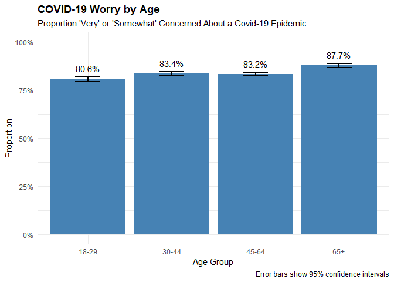
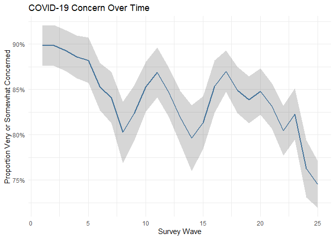
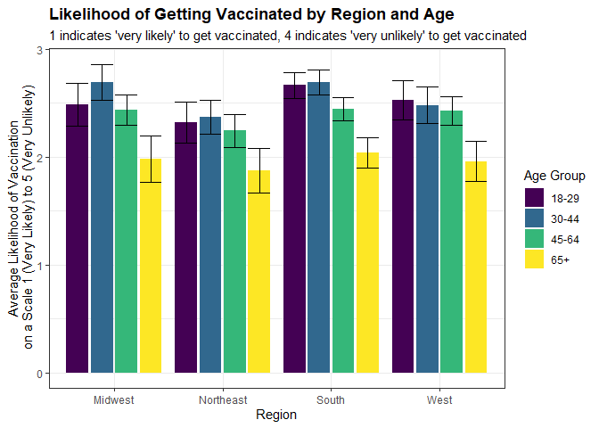
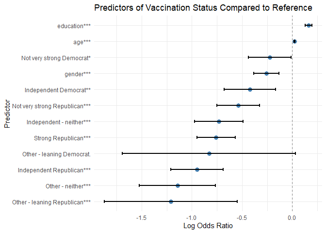
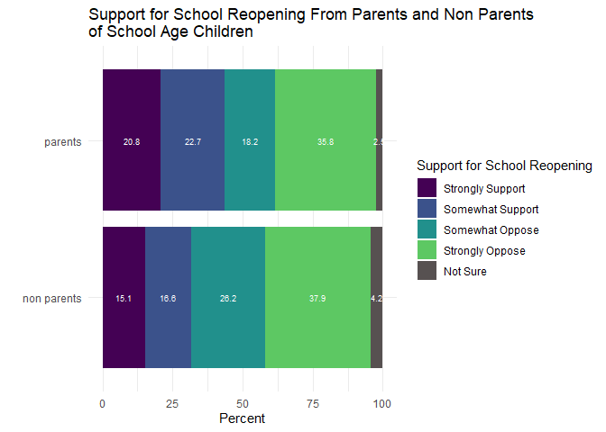
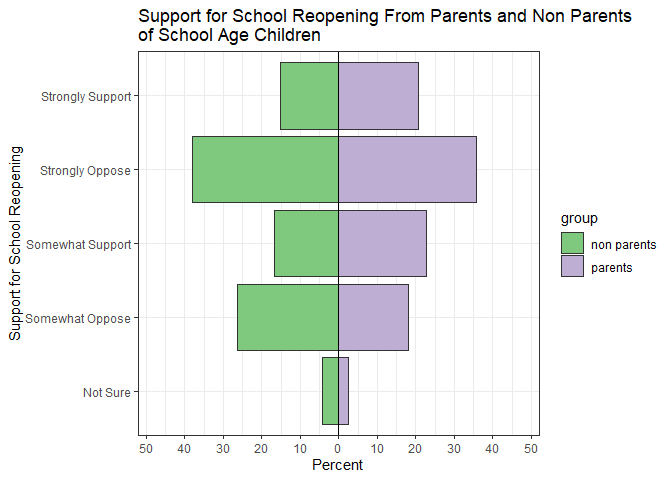

# Survey Analysis
Allie Warren, allison.warren
2025-12-09

- [Survey Data Analysis Tutorial](#survey-data-analysis-tutorial)
  - [DFP COVID-19 Tracking Poll](#dfp-covid-19-tracking-poll)
  - [R {survey} package](#r-survey-package)
  - [Resources](#resources)
  - [Setup and Data Loading](#setup-and-data-loading)
  - [Define the Survey Design](#define-the-survey-design)
  - [Adding new variables](#adding-new-variables)
  - [Calculate Weighted Means and
    Proportions](#calculate-weighted-means-and-proportions)
    - [Single Variable Analysis](#single-variable-analysis)
    - [By Group](#by-group)
    - [Over Time](#over-time)
    - [By Multiple Grouping Variables](#by-multiple-grouping-variables)
  - [Chi-Square Tests](#chi-square-tests)
  - [Comparing Group Means](#comparing-group-means)
    - [T-test](#t-test)
    - [Proportional Odds Model](#proportional-odds-model)
  - [Regression Analysis](#regression-analysis)
    - [Coefficient Plot (Regression
      Results)](#coefficient-plot-regression-results)
  - [Subgroup Analysis](#subgroup-analysis)

# Survey Data Analysis Tutorial

A guide to analyzing survey data using the R {survey} package

## DFP COVID-19 Tracking Poll

This tutorial uses data from periodic tracking polls conducted by Data
for Progress to track Americans response to the COVID-19 pandemic. The
survey contains polls from 25 weeks, with each week’s survey including
interviews with 800-1200 respondents. The data contains individual level
responses to the survey, with post-stratification weights to make each
week’s sample nationally representative of American adults and separate
weights to make representative of American registered voters.

## R {survey} package

This tutorial uses the R {survey} package, which is a very useful
package for applying survey weights, calculating means, creating
weighted proportion tables, and calculating statistical tests.

When using the {survey} package, you first create a survey design object
using the function `svydesign()`, which allows you to specify the survey
weights. The {survey} package uses base R conventions, to refer to
variables/column names the precede the names with a tilde (~). Then we
can use various {survey} functions to apply the weights and calculate
various survey statistics. Additional useful functions are:

- `svyby()`: compute survey statistics on subsets of a survey defined by
  factors
- `svymean()`: compute means for the survey data
- `svytable()`: contingency tables, computes a weighted cross
  tabulation, which is useful for producing outputs for plots
- `svychisq()`: chisquared tests of association for survey data,
  computes first and second order Rao-Scott correction to the Peason
  chisquared test, can specify F stat (default), Chisq, Wald, adjWald,
  lincom, or saddlepoint
- `svytest()`: one-sample or two-sample t-test

## Resources

- [Survey package
  documentation](https://r-survey.r-forge.r-project.org/survey/)
- [Survey examples from
  UCLA](http://r-survey.r-forge.r-project.org/survey/ucla-examples.pdf)
- [Introduction to Survey
  Package](https://zacharylhertz.github.io/posts/2021-06-29-survey-package/index.html):
  used as inspiration for these examples
- [Data
  Source](https://dataverse.harvard.edu/dataset.xhtml?persistentId=doi:10.7910/DVN/XJLZIN)

## Setup and Data Loading

``` r
# Loading packages

# the pacman package is useful for managing package install/loading, When using pacman to load a package it will automatically install the package if it is not already installed
if(!require("pacman")) install.packages("pacman") #but first we have to install pacman
```

    Loading required package: pacman

``` r
# This load packages for reading in data, transforming data, reshaping data, working with strings, summarizing data, analyzing surey data, reading in other data types, formatting percentages, structuring code, creating other types of plots, creating general plots, handlin factors
pacman::p_load(readr, plyr, dplyr, tidyr, stringr, skimr, survey, haven, scales, magrittr, apyramid, ggplot2, forcats)
```

``` r
base_file_path <- "../data"
# Load the DFP COVID-19 survey data
dfp_data <- read_dta(file.path(base_file_path, "dataverse_files/dfp_covid_tracking_poll.dta"))

# view a subset of the data
head(dfp_data)
```

    # A tibble: 6 × 220
      nationalweight rid      age gender    hhi ethnicity hispanic education educ   
               <dbl> <chr>  <dbl> <dbl+l> <dbl>     <dbl>    <dbl>     <dbl> <dbl+l>
    1          1.61  609ab…    81 1 [Mal…     6         1        1         3 2 [HS …
    2          0.843 609ab…    55 2 [Fem…    20         1        1         6 5 [4 y…
    3          1.21  609ab…    65 1 [Mal…     3         1        1         2 2 [HS …
    4          0.578 609ab…    78 2 [Fem…     5         1        1         5 4 [2 y…
    5          0.271 609ab…    66 2 [Fem…     3         1        1         7 6 [Pos…
    6          0.622 609ab…    31 2 [Fem… -3105         1        1         4 3 [Som…
    # ℹ 211 more variables: political_party <chr>, region <dbl>, zip <chr>,
    #   wave <dbl>, starttime <dttm>, endtime <dttm>, inputstate <dbl+lbl>,
    #   votereg <dbl+lbl>, inputregstate <dbl+lbl>, pid7 <dbl>, ideo5 <dbl+lbl>,
    #   child18 <dbl+lbl>, Q44 <dbl+lbl>, marstat <dbl+lbl>, intent <dbl+lbl>,
    #   pres_2020_voted <dbl+lbl>, sources_1 <dbl+lbl>, sources_2 <dbl+lbl>,
    #   sources_3 <dbl+lbl>, sources_4 <dbl+lbl>, sources_5 <dbl+lbl>,
    #   sources_6 <dbl+lbl>, sources_7 <dbl+lbl>, sources_8 <dbl+lbl>, …

``` r
# get stats for a subset of the data
skimr::skim(dfp_data[,1:25])
```

|                                                  |                    |
|:-------------------------------------------------|:-------------------|
| Name                                             | dfp_data\[, 1:25\] |
| Number of rows                                   | 24727              |
| Number of columns                                | 25                 |
| \_\_\_\_\_\_\_\_\_\_\_\_\_\_\_\_\_\_\_\_\_\_\_   |                    |
| Column type frequency:                           |                    |
| character                                        | 3                  |
| numeric                                          | 20                 |
| POSIXct                                          | 2                  |
| \_\_\_\_\_\_\_\_\_\_\_\_\_\_\_\_\_\_\_\_\_\_\_\_ |                    |
| Group variables                                  | None               |

Data summary

**Variable type: character**

| skim_variable   | n_missing | complete_rate | min | max | empty | n_unique | whitespace |
|:----------------|----------:|--------------:|----:|----:|------:|---------:|-----------:|
| rid             |         0 |             1 |  36 |  36 |     0 |    24727 |          0 |
| political_party |         0 |             1 |   1 |   2 |     0 |       10 |          0 |
| zip             |         0 |             1 |   3 |  10 |     0 |    10703 |          0 |

**Variable type: numeric**

| skim_variable | n_missing | complete_rate | mean | sd | p0 | p25 | p50 | p75 | p100 | hist |
|:---|---:|---:|---:|---:|---:|---:|---:|---:|---:|:---|
| nationalweight | 0 | 1.00 | 1.00 | 0.61 | 0.08 | 0.62 | 0.85 | 1.19 | 6.9 | ▇▁▁▁▁ |
| age | 0 | 1.00 | 47.75 | 17.18 | 18.00 | 33.00 | 48.00 | 62.00 | 98.0 | ▇▇▇▅▁ |
| gender | 0 | 1.00 | 1.56 | 0.50 | 1.00 | 1.00 | 2.00 | 2.00 | 2.0 | ▆▁▁▁▇ |
| hhi | 0 | 1.00 | -145.05 | 676.69 | -3105.00 | 3.00 | 8.00 | 15.00 | 24.0 | ▁▁▁▁▇ |
| ethnicity | 0 | 1.00 | 2.35 | 3.76 | 1.00 | 1.00 | 1.00 | 1.00 | 16.0 | ▇▁▁▁▁ |
| hispanic | 0 | 1.00 | 1.58 | 2.53 | 1.00 | 1.00 | 1.00 | 1.00 | 16.0 | ▇▁▁▁▁ |
| education | 0 | 1.00 | 4.64 | 1.93 | 1.00 | 3.00 | 5.00 | 6.00 | 8.0 | ▇▁▇▇▅ |
| educ | 0 | 1.00 | 3.85 | 1.55 | 1.00 | 2.00 | 4.00 | 5.00 | 6.0 | ▇▆▂▇▅ |
| region | 0 | 1.00 | 2.60 | 1.04 | 1.00 | 2.00 | 3.00 | 3.00 | 4.0 | ▅▅▁▇▅ |
| wave | 0 | 1.00 | 13.81 | 7.50 | 1.00 | 7.00 | 14.00 | 20.00 | 25.0 | ▆▆▆▇▇ |
| inputstate | 3 | 1.00 | 25.27 | 15.20 | 1.00 | 10.00 | 26.00 | 38.00 | 53.0 | ▇▃▅▆▅ |
| votereg | 0 | 1.00 | 1.15 | 0.40 | 1.00 | 1.00 | 1.00 | 1.00 | 3.0 | ▇▁▁▁▁ |
| inputregstate | 3391 | 0.86 | 25.11 | 15.14 | 1.00 | 10.00 | 26.00 | 38.00 | 53.0 | ▇▃▅▆▅ |
| pid7 | 0 | 1.00 | 4.07 | 2.44 | 1.00 | 2.00 | 4.00 | 7.00 | 8.0 | ▇▂▃▂▆ |
| ideo5 | 1 | 1.00 | 3.25 | 1.32 | 1.00 | 2.00 | 3.00 | 4.00 | 6.0 | ▆▇▅▃▂ |
| child18 | 3 | 1.00 | 1.68 | 0.47 | 1.00 | 1.00 | 2.00 | 2.00 | 2.0 | ▃▁▁▁▇ |
| Q44 | 16971 | 0.31 | 1.13 | 0.33 | 1.00 | 1.00 | 1.00 | 1.00 | 2.0 | ▇▁▁▁▁ |
| marstat | 0 | 1.00 | 2.80 | 1.89 | 1.00 | 1.00 | 3.00 | 5.00 | 6.0 | ▇▂▁▅▁ |
| intent | 14253 | 0.42 | 6.40 | 3.54 | 1.00 | 1.00 | 9.00 | 9.00 | 9.0 | ▃▁▁▁▇ |
| pres_2020_voted | 18104 | 0.27 | 1.48 | 0.58 | 1.00 | 1.00 | 1.00 | 2.00 | 4.0 | ▇▆▁▁▁ |

**Variable type: POSIXct**

| skim_variable | n_missing | complete_rate | min | max | median | n_unique |
|:---|---:|---:|:---|:---|:---|---:|
| starttime | 0 | 1 | 2020-04-14 09:42:09 | 2021-05-19 06:08:55 | 2020-09-01 13:54:20 | 23194 |
| endtime | 0 | 1 | 2020-04-14 09:54:01 | 2021-05-19 06:19:46 | 2020-09-01 14:15:43 | 23558 |

## Define the Survey Design

The first step is defining the survey design object with appropriate
weights

``` r
# Create survey design object
# the survey data includes post-stratification weights, which are implemented to make each week’s sample nationally representative of American adults and American registered voters by gender, age, region, education, race, the interaction of education and race, and previous presidential vote.
dfp_design <- svydesign(
  ids = ~1,                      # No clustering 
  weights = ~nationalweight,     # Survey weights for national adult population
  data = dfp_data)

# We could also create a survey design object for a subset of the data - registered voters subset, for this subset, we use rvweight instead
dfp_rv_design <- svydesign(
    ids = ~1,
    weights = ~rvweight, # Survey weights for national registered voter population
    data = filter(dfp_data, !is.na(rvweight)))
```

## Adding new variables

``` r
# adding a binary variable for vaccination status
# in the data 1=Yes, received at least one COVID-19 vaccination, 2=No, I have not received a COVID-19 vaccination
dfp_design<-update(dfp_design, vax_bin=if_else(vax == 1, 1, 0))
```

## Calculate Weighted Means and Proportions

### Single Variable Analysis

``` r
# example survey question/responses
dfp_data$corona2 |> unique()
```

    <labelled<double>[5]>: How concerned are you about a coronavirus epidemic here in the United States?
    [1]  2  3  1  4 NA

    Labels:
     value                label
         1       Very concerned
         2   Somewhat concerned
         3   Not very concerned
         4 Not at all concerned

``` r
# Proportion worried about a COVID-19 epidemic, on a scale 1 (very concerned) to 4 (not concerned)
svymean(~corona2, dfp_design, na.rm = TRUE)
```

              mean     SE
    corona2 1.6918 0.0066

``` r
# With confidence intervals
confint(svymean(~corona2, dfp_design, na.rm = TRUE))
```

               2.5 %   97.5 %
    corona2 1.678946 1.704748

``` r
# Mean approval of CDC COVID handling - scale 1 (Strongly Approve) to 4 (Strongly Disapprove), removing NAs and those who answered 5 (Not Sure)
svymean(~dfp_public_figure_ap_10, subset(dfp_design, dfp_public_figure_ap_10 %in% c(1,2,3,4)), na.rm = TRUE)
```

                              mean     SE
    dfp_public_figure_ap_10 2.0739 0.0072

``` r
# Mean approval of CDC COVID handling among registered voters - scale 1 (Strongly Approve) to 4 (Strongly Disapprove), removing NAs and those who answered 5 (Not Sure)
svymean(~dfp_public_figure_ap_10, subset(dfp_rv_design, dfp_public_figure_ap_10 %in% c(1,2,3,4)), na.rm = TRUE)
```

                              mean    SE
    dfp_public_figure_ap_10 2.0253 0.009

### By Group

``` r
# COVID worry by age
# add an age group category
dfp_design<-update(dfp_design, age_group=case_when(age < 30 ~ 1,
                                                   age < 45 ~ 2,
                                                   age < 65 ~ 3,
                                                   age >= 65 ~ 4))

# add a category for very or somewhat concerned (a 1 or 2 survey response)
dfp_design<-update(dfp_design, corona2_worried=ifelse(corona2 %in% c(1,2), 1, 0))

# Calculate proportions with CIs
worry_props <- svyby(
  formula = ~corona2_worried,  # Very or somewhat concerned
  by = ~age_group,
  design = dfp_design,
  FUN = svymean,
  na.rm = TRUE,
  vartype = c("se", "ci")
)

# Clean up for plotting
worry_plot_data <- worry_props |>
  dplyr::rename(proportion = corona2_worried) |> 
  mutate(age_group = case_when(age_group == 1 ~ '18-29',
                               age_group == 2 ~ '30-44',
                               age_group == 3 ~ '45-64',
                               age_group == 4 ~ '65+'))

# Create plot, showing proportion by age group
ggplot(worry_plot_data, aes(x = age_group, y = proportion)) +
  geom_col(fill = "steelblue") + # set color
  geom_errorbar(aes(ymin = ci_l, ymax = ci_u), width = 0.3, linewidth = 0.8) + # add error bars
  geom_text(aes(label = percent(proportion, accuracy = 0.1)),vjust = -0.5, nudge_y = 0.02) + # add labels above the bars
  scale_y_continuous(labels = percent_format(), limits = c(0, 1)) + # format y-axis as percents
  labs(title = "COVID-19 Worry by Age",
    subtitle = "Proportion 'Very' or 'Somewhat' Concerned About a Covid-19 Epidemic",
    x = "Age Group", y = "Proportion", caption = "Error bars show 95% confidence intervals") +
  theme_minimal() + # set theme
  theme(plot.title = element_text(face = "bold")) # make title bold
```



### Over Time

``` r
# the survey data includes results from multiple time points/waves of covid
wave_comparison <- svyby(
  formula = ~I(corona2 <= 2),  # can create an indicator variable, for those very or somewhat concerned about COVID
  by = ~wave, # calculate means per wave
  design = dfp_design,
  FUN = svymean,
  na.rm = TRUE,
  vartype = "ci" # also return confidence intervals
)

# Plot trends over time
ggplot(wave_comparison, aes(x = wave, y = `I(corona2 <= 2)TRUE`)) +
  geom_line(linewidth = 1, color = "steelblue") +
  geom_ribbon(aes(ymin = `ci_l.I(corona2 <= 2)TRUE`, ymax = `ci_u.I(corona2 <= 2)TRUE`), alpha = 0.2) + # add error ribbon showing the confidence intervals
  scale_y_continuous(labels = percent_format()) + # format y axis as percent
  labs(title = "COVID-19 Concern Over Time",
    x = "Survey Wave",
    y = "Proportion Very or Somewhat Concerned") +
  theme_minimal() 
```



### By Multiple Grouping Variables

``` r
# Vaccine likelihood by region and age group 
# ages are 18-98, grouped into 5 categories
# 'How likely are you to get the [COVID-19] vaccine?'on scale of 1 (very likely) to 4 (very unlikely)
vax_by_region_age <- svyby(
  formula = ~vax_likely,
  by = ~region + age_group,
  design = dfp_design,
  FUN = svymean,
  na.rm = TRUE,
  vartype = c('se', 'ci')) # return standard error and confidence interval, as well as mean

# format output for plotting - converting numeric categories to named
vax_by_region_age <- vax_by_region_age |> 
  mutate(region_name = case_when(region == 1 ~ 'Northeast',
                                 region == 2 ~ 'Midwest',
                                 region == 3 ~ 'South',
                                 region == 4 ~ 'West'),
         age_group_name = case_when(age_group == 1 ~ '18-29',
                                    age_group == 2 ~ '30-44',
                                    age_group == 3 ~ '45-64',
                                    age_group == 4 ~ '65+'))


# create bar plot, with bars showing the confidence intervals
ggplot(vax_by_region_age, aes(region_name, vax_likely, fill = age_group_name)) +
  geom_col(position = position_dodge2()) +
  geom_errorbar(aes(ymin = ci_l, ymax = ci_u), position = position_dodge2()) +
  theme_bw() +
  viridis::scale_fill_viridis(discrete = TRUE, option = 'D') +
  labs(x = 'Region',
       y = 'Average Likelihood of Vaccination\n on a Scale 1 (Very Likely) to 5 (Very Unlikely)',
       fill = 'Age Group',
       title = 'Likelihood of Getting Vaccinated by Region and Age',
       subtitle = "1 indicates 'very likely' to get vaccinated, 5 indicates 'very unlikely' to get vaccinated") +
   theme(plot.title = element_text(face = "bold")) # make title bold
```



## Chi-Square Tests

Tests whether two categorical variables are indendent or associated

``` r
# Test if vaccination status differs by political party
# outputs: x-squared: test statistic, higher = stronger association
# df = degrees of freedom, p-value
svychisq(~vax_bin + political_party, dfp_design, statistic = "Chisq")
```


        Pearson's X^2: Rao & Scott adjustment

    data:  svychisq(~vax_bin + political_party, dfp_design, statistic = "Chisq")
    X-squared = 610.69, df = 9, p-value < 2.2e-16

``` r
# With Rao-Scott adjusted F test (recommended for survey data) - accounts for complex survey design and weighting, more robust
# outputs: F: test statistic, higher = stronger association
# ndf: numerator degrees of freedom, ddf: denominator degrees of freedom, p-value
svychisq(~vax_bin + political_party, dfp_design, statistic = "F")
```


        Pearson's X^2: Rao & Scott adjustment

    data:  svychisq(~vax_bin + political_party, dfp_design, statistic = "F")
    F = 14.685, ndf = 8.7895e+00, ddf = 2.1733e+05, p-value < 2.2e-16

## Comparing Group Means

### T-test

Tests whether the mean of a variable differs between two groups

``` r
# Compare worry levels by gender - corona2 asks "how concerned are you about a coronavirus epidemic here in the United States?"
# responses are on a scale 1 to 4, with 1 being 'very concerned', and 4 being 'not at all concerned'
# can look a the proportions of respondents answering each for male (1) vs female (2)
concern_proportions =  data.frame(male = svytable(formula = ~corona2, design = subset(dfp_design, gender == 1)) |> prop.table(),
female = svytable(formula = ~corona2, design = subset(dfp_design, gender == 2)) |> prop.table(),
survey_response = c('very concerned', 'somewhat concerned', 'not very concerned', 'not at all concerned'))
concern_proportions
```

      male.corona2  male.Freq female.corona2 female.Freq      survey_response
    1            1 0.48986762              1  0.55605846       very concerned
    2            2 0.32386704              2  0.30193854   somewhat concerned
    3            3 0.12336310              3  0.09929710   not very concerned
    4            4 0.06290224              4  0.04270591 not at all concerned

``` r
# outputs: t: test statistics, negative = first group (male) has lower mean than the second group (female)
# df: degrees of freedom, p-value, difference in mean, confidence interval
svyttest(corona2 ~ gender, dfp_design)
```


        Design-based t-test

    data:  corona2 ~ gender
    t = -9.9024, df = 24716, p-value < 2.2e-16
    alternative hypothesis: true difference in mean is not equal to 0
    95 percent confidence interval:
     -0.1565099 -0.1047891
    sample estimates:
    difference in mean 
            -0.1306495 

### Proportional Odds Model

A t-test is intended for continuous variables, while the response to
‘How concerned are you about a coronavirus epidemic here in the United
States?’ is an ordinal variable. We can also compare groups using
proportional odds with ordinal logistic regression.

``` r
# Ensure corona2 is ordered factor
dfp_data <- dfp_data |>
  mutate(corona2_factor = factor(corona2,
      levels = 1:4,
      labels = c("Very concerned", "Somewhat concerned", 
                 "Not very concerned", "Not at all concerned"),
      ordered = TRUE))
# Update design
dfp_design <- update(dfp_design, corona2_factor = dfp_data$corona2_factor)

# Proportional odds model
# gives the log odds ratio for the relationship between gender and covid concern
# (negative = males have lower odds of being in high concern categories)
svyolr(corona2_factor ~ gender, design = dfp_design)
```

    Call:
    svyolr(corona2_factor ~ gender, design = dfp_design)

    Coefficients:
        gender 
    -0.2822621 

    Intercepts:
          Very concerned|Somewhat concerned   Somewhat concerned|Not very concerned 
                                 -0.3318951                               1.2109077 
    Not very concerned|Not at all concerned 
                                  2.4739669 

## Regression Analysis

``` r
# Logistic regression: predict (binary outcome of) vaccination status based on multiple predictors
vax_model <- svyglm(
  vax_bin ~ age + gender + political_party + education,
  design = dfp_design,
  family = quasibinomial()
)

# outputs: coefficients: log odds, standard error, t-value, p-value, significance
summary(vax_model)
```


    Call:
    svyglm(formula = vax_bin ~ age + gender + political_party + education, 
        design = dfp_design, family = quasibinomial())

    Survey design:
    update(dfp_design, corona2_factor = dfp_data$corona2_factor)

    Coefficients:
                       Estimate Std. Error t value Pr(>|t|)    
    (Intercept)       -1.918081   0.190018 -10.094  < 2e-16 ***
    age                0.022285   0.001987  11.217  < 2e-16 ***
    gender            -0.256427   0.064208  -3.994 6.57e-05 ***
    political_party10 -0.758721   0.096502  -7.862 4.32e-15 ***
    political_party2  -0.222717   0.108218  -2.058 0.039622 *  
    political_party3  -0.421253   0.130251  -3.234 0.001225 ** 
    political_party4  -0.731200   0.122791  -5.955 2.73e-09 ***
    political_party5  -0.948121   0.133348  -7.110 1.27e-12 ***
    political_party6  -0.830038   0.439460  -1.889 0.058963 .  
    political_party7  -1.144731   0.192588  -5.944 2.91e-09 ***
    political_party8  -1.208374   0.337399  -3.581 0.000344 ***
    political_party9  -0.538513   0.108485  -4.964 7.07e-07 ***
    education          0.160381   0.017575   9.126  < 2e-16 ***
    ---
    Signif. codes:  0 '***' 0.001 '**' 0.01 '*' 0.05 '.' 0.1 ' ' 1

    (Dispersion parameter for quasibinomial family taken to be 0.999735)

    Number of Fisher Scoring iterations: 4

``` r
# Extract coefficients with confidence intervals
tidy_model <- broom::tidy(vax_model, conf.int = TRUE)
```

### Coefficient Plot (Regression Results)

``` r
# Using the regression model from earlier
# adjust data for plotting
coef_plot_data <- tidy_model |>
  filter(term != "(Intercept)") |>
  # convert political party numbers to responses
  mutate(term_name = case_when(term == 'political_party2' ~ 'Not very strong Democrat',
                               term == 'political_party3' ~ 'Independent Democrat',
                               term == 'political_party4' ~ 'Independent - neither',
                               term == 'political_party5' ~ 'Independent Republican',
                               term == 'political_party6' ~ 'Other - leaning Democrat',
                               term == 'political_party7' ~ 'Other - neither',
                               term == 'political_party8' ~ 'Other - leaning Republican',
                               term == 'political_party9' ~ 'Not very strong Republican',
                               term == 'political_party10' ~ 'Strong Republican',
                               TRUE ~ term),
    # add variable significance to term name
    term_signif = paste0(term_name, case_when(p.value <= .001 ~ '***',
                                    p.value <= .01 ~ '**',
                                    p.value <= .05 ~  '*',
                                    p.value <= .1 ~ '.',
                                    p.value <= 1 ~ " "))) |> 
  # order terms by estimate value, set as a factor (will preserve order for plotting)
  mutate(term_signif = fct_reorder(term_signif, estimate))

# create plot of log odds ratios, with confidence intervals for each term
ggplot(coef_plot_data, aes(x = estimate, y = term_signif)) +
  geom_vline(xintercept = 0, linetype = "dashed", color = "gray50") +
  geom_point(size = 3, color = "steelblue") +
  geom_errorbar(aes(xmin = conf.low, xmax = conf.high),
                height = 0.2,
                linewidth = 0.8) +
  labs(title = "Predictors of Vaccination Status Compared to Reference",
    x = "Log Odds Ratio",
    y = "Predictor") +
  theme_minimal()
```

    `height` was translated to `width`.



## Subgroup Analysis

Computing weighted crosstabulation for subsets of the data

``` r
# Analyze only parents with school-age children
# Q44 = are you the parent or guardian of a child currently enrolled in school
parents_design <- subset(dfp_design, Q44 == 1)

# School reopening preferences among parents
# 1 = Strongly support school reopening, 4 = strongly oppose, 5 = not sure
# svytable compute weighted crosstabulation
school.parents <- svytable(~schools_1, design=parents_design) |> 
  prop.table() |> 
  multiply_by(100) |> 
  round(digits=1) |> 
  as.data.frame() |> 
  mutate(group = 'parents')

# Compare to non-parents
nonparents_design <- subset(dfp_design, Q44 == 2)
school.nonparents <- svytable(~schools_1, design=nonparents_design) |> 
  prop.table() |> 
  multiply_by(100) |> 
  round(digits=1) |> 
  as.data.frame() |> 
  mutate(group = 'non parents')


# Combine into a single dataframe for plotting
school_parents_plot <- rbind(school.parents, school.nonparents)

# Create a variable, label_ypos, equal to the halfway point
# in each bar for specifying where the labels should be.
school_parents_plot <- plyr::ddply(school_parents_plot, "group",
              transform, 
              label_ypos=cumsum(Freq) - 0.5*Freq)

color_scale <- viridis::viridis(5)
color_scale[5] <- "#575151"

# plot the proportions of responses for each subset of the data
ggplot(school_parents_plot, aes(x = group, y = Freq, fill = schools_1)) + 
  geom_bar(stat="identity", 
           position = position_stack(reverse = TRUE)) + 
  geom_text(aes(y=label_ypos, label=Freq), 
            color="white", size=2.5) +
  coord_flip() + 
  scale_fill_manual(labels = c("Strongly Support", 
                               "Somewhat Support", 
                               "Somewhat Oppose", 
                               "Strongly Oppose",
                               "Not Sure"), values=color_scale) +
  theme_minimal() + 
  ylab("Percent") + xlab('') +
  labs(fill="Support for School Reopening") +
  ggtitle("Support for School Reopening From Parents and Non Parents\nof School Age Children")
```



``` r
# another option for visualizing
school_parents_plot |> 
  mutate(school_responses = as.factor(case_when(schools_1 == 1 ~ 'Strongly Support',
                                      schools_1 == 2 ~ 'Somewhat Support',
                                      schools_1 == 3 ~ 'Somewhat Oppose',
                                      schools_1 == 4 ~ 'Strongly Oppose',
                                      schools_1 == 5 ~ 'Not Sure'))) |> 
  age_pyramid(age_group = "school_responses",
    split_by = "group", 
    count ='Freq',
    show_midpoint = FALSE) +
  labs(title = "Support for School Reopening From Parents and Non Parents\nof School Age Children", 
       x = "Support for School Reopening", 
       y = "Percent") +
  theme_bw()
```


